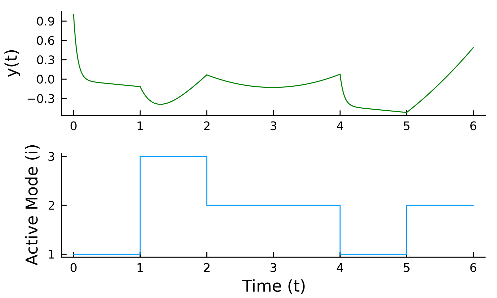
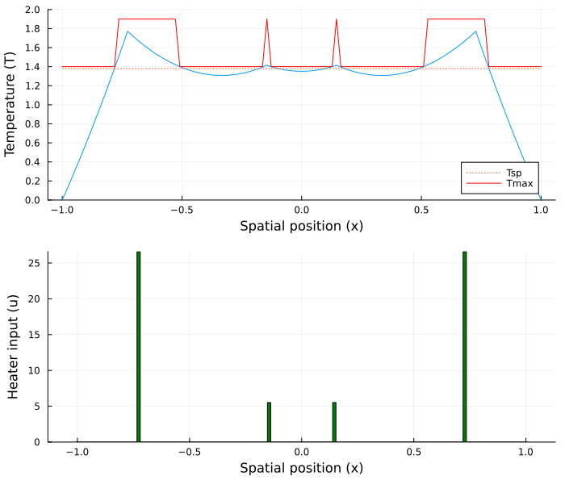

# Infinite Generalized Disjunctive Programming (InfiniteGDP) Case Studies
This folder contains the source code to the InfiniteGDP case study results presented in "Advanced to Modelling and Solving Infinite-Dimensional Optimization Problems in `InfiniteOpt.jl`" by Evelyn Gondosiswanto and Joshua L. Pulsipher.

To run the source code, the master version of `InfiniteOpt.jl` and `DisjunctiveProgramming.jl` are required and can be installed as follows:

```julia
julia> import Pkg

julia> Pkg.add(url = "https://github.com/infiniteopt/InfiniteOpt.jl", rev = "master")

julia> Pkg.add(url = "https://github.com/hdavid16/DisjunctiveProgramming.jl", rev = "infiniteopt_ext")
```

## Case Study 1: Tank Changeover Operation
This is the source code for the tank changeover case study that features discrete-continuous decisions. The entirety of this case study is contained in `tankChangeover.jl`.



### Running the code
To configure the required packages, it is recommended to create a Julia environment using the `Project.toml` file. Creating the environment and running the case study can be done as follows:
```julia
julia> cd("[PATH_TO_FILES]/InfiniteGDP/")

julia> ]

(@v1.10) pkg> activate .

(InfiniteGDP) pkg> instantiate

julia> include("tankChangeover.jl")
```

## Case Study 2: 1D Temperature Control of a Heated Strip
This is the source code for the 1D heated strip case study which demonstrates the use of infinite logical variables. The entirety of this case study is contained in `1DheatedStrip.jl`.




### Running the code
To configure the required packages, it is recommended to create a Julia environment using the `Project.toml` file. Creating the environment and running the case study can be done as follows:
```julia
julia> cd("[PATH_TO_FILES]/InfiniteGDP/")

julia> ]

(@v1.10) pkg> activate .

(InfiniteGDP) pkg> instantiate

julia> include("1DheatedStrip.jl")
```

## GDP Reformulation Comparison Study
This is the source code for the comparison study . The entirety of this study is contained in `GDPreformulation.jl`.

### Running the code
To configure the required packages, it is recommended to create a Julia environment using the `Project.toml` file. Creating the environment and running the case study can be done as follows:
```julia
julia> cd("[PATH_TO_FILES]/InfiniteGDP/")

julia> ]

(@v1.10) pkg> activate .

(InfiniteGDP) pkg> instantiate

julia> include("GDPreformulation.jl")
```